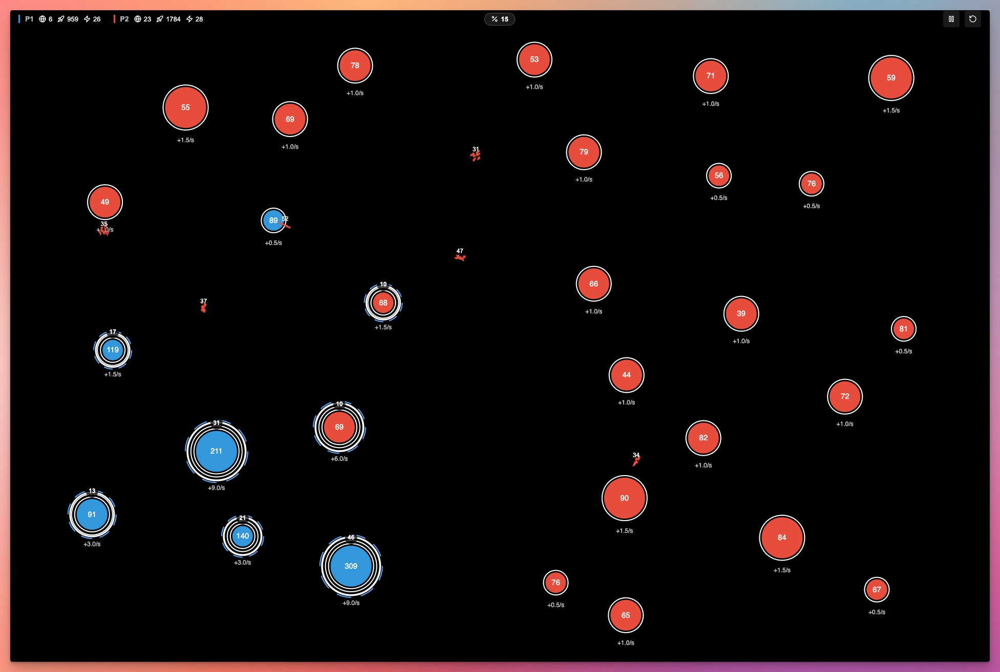

# DISCLAIMER: 

THIS PROJECT HAS BEEN "VIBE-CODED" USING CURSOR EDITOR. IT IS NOT MY BEST WORK... OR EVEN MY WORK NOW THAT I THINK ABOUT IT.

# Stellar Conquest

A fast-paced real-time strategy game where players compete to conquer a galaxy by capturing planets and deploying fleets. Inspired by Galcon.



## Game Overview

In Stellar Conquest, you'll compete to control a galaxy by strategically sending fleets from your planets to conquer neutral and enemy planets. Each planet continually produces ships that can be deployed to expand your territory or attack your opponents.

## Core Mechanics

- **Planets**: Vary in size (small, medium, large) which determines their maximum garrison capacity and production rate
- **Planet Upgrades**: Planets can be upgraded to increase production rates and capacities
- **Fleets**: Send ships from your planets to capture others or reinforce your existing territory
- **Combat**: When fleets reach a planet, they either add to the garrison (if friendly) or attack (if neutral/enemy)
- **AI Opponents**: Play against AI opponents with adjustable difficulty levels (easy, medium, hard)

## How to Play

1. Start by configuring your game on the start screen
2. Click on one of your planets (blue) to select it
3. Click and drag to another planet to send ships
4. Use the percentage buttons to control how many ships to send (25%, 50%, 75%, 100%)
5. Capture neutral planets (gray) to expand your territory
6. Attack enemy planets (red) to decrease their control
7. Win by eliminating all enemy planets

## Installation

```bash
# Clone the repository
git clone https://github.com/yourusername/stellar-conquest.git

# Navigate to the project directory
cd stellar-conquest

# Install dependencies
yarn install

# Start the development server
yarn dev
```

## Build and Deployment

```bash
# Build for production
yarn build

# Preview the production build locally
yarn preview
```

This project is configured for GitHub Pages deployment through GitHub Actions. When you push to the main branch, it will automatically deploy to GitHub Pages.

## Technologies Used

- React 19 with TypeScript
- Vite for build tooling
- HTML5 Canvas for game rendering
- CSS for UI styling
- GitHub Actions for CI/CD

## Project Structure

- `src/game/` - Game logic, AI and core mechanics
- `src/components/` - React components for UI and rendering
- `src/utils/` - Utility functions

## Development

To contribute to the project:

1. Fork the repository
2. Create a feature branch (`git checkout -b feature/amazing-feature`)
3. Commit your changes (`git commit -m 'Add some amazing feature'`)
4. Push to the branch (`git push origin feature/amazing-feature`)
5. Open a Pull Request

## License

This project is licensed under the GLWTS(Good Luck With That Shit) Public License - see the LICENSE file for details.

Basically, you can do whatever you want with this code, but you're on your own. Good luck! 